## 1.添加依赖

添加依赖(以 **`maven`** 作为依赖管理工具作为示例)：

```
<dependency>
    <groupId>org.springframework.boot</groupId>
    <artifactId>spring-boot-starter-security</artifactId>
</dependency>
```

添加依赖后，再次运行项目，访问api会跳转到 **`localhost:8080/login`** 界面，邀请我们登录才允许访问，我们可以使用 **`spring-security`** 随机分配的账号密码进行登录，例如：

```
// 没有指定用户名 则默认是 user
// 密码是随机产生的
用户名：user
密码：386fd313-7a67-4e5c-9a5a-49a46de652c5
```


这里的登录是spring-security提供的默认 **表单登录**，**`Form Data`** 如下：

```
username: user
password: 386fd313-7a67-4e5c-9a5a-49a46de652c5
_csrf: 59d6630e-5d7b-42c0-8787-21aef53a50ca
```

⚠️：可以在浏览器中输入 **`localhost:8080/logout`** 退出登录


## 2.Basic Auth

- 对应分支01：[01_bootstrap - github](https://github.com/jamessawyer/spring-security/tree/01_bootstrap)

- 对应视频：[25:28](https://www.youtube.com/watch?v=her_7pa0vrg&t=1528s) - BASIC AUTH OVERVIEW

基本验证流程如下：

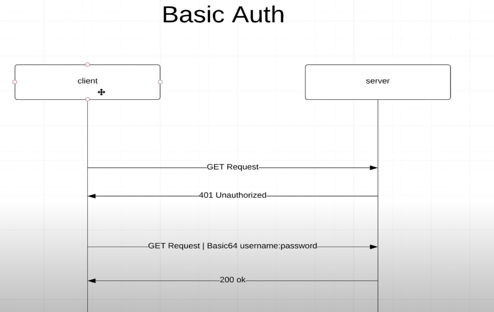

1. 客户端发送请求，服务端发现改接口需要验证，返回 **401** 错误
2. 客户端将 **用户名+密码** 进行 **`base64`** 发送给服务端，服务器查找用户名，发现存在之后，再对比密码，如果存在该用户则请求成功

添加basic auth:

1. 项目中添加 **`security`** package
2. 添加 **`ApplicationSecurityConfig`** 类，这个类继承自 **`WebSecurityConfigurerAdapter`**,实现 **`void configure(HttpSecurity http)`** 方法（IDEA中可以使用 **`ctrl+O`** 查看接口的属性和方法）

```java
package com.amigo.securities.security;

import org.springframework.context.annotation.Configuration;
import org.springframework.security.config.annotation.web.builders.HttpSecurity;
import org.springframework.security.config.annotation.web.configuration.EnableWebSecurity;
import org.springframework.security.config.annotation.web.configuration.WebSecurityConfigurerAdapter;

@Configuration
@EnableWebSecurity
public class ApplicationSecurityConfig extends WebSecurityConfigurerAdapter {
    @Override
    protected void configure(HttpSecurity http) throws Exception {
      // 表示 任何请求都需要验证 并且 使用 basic auth
        http
            .authorizeRequests()
            .anyRequest()
            .authenticated()
            .and()
            .httpBasic();
    }
}
```

重启项目，此时访问接口，则浏览器会弹出登录的弹框：（**或者使用postman进行接口请求**）


使用框架提供的用户名和账号进行登录：

```
用户名 user
密码 b9168aba-9719-4042-a541-32652378b4a1
```

这种形式的缺点就是 **每次请求都需要携带用户名和密码，base64加密并不安全，另外服务器每次都要都携带的用户名和密码进行比对。另外⚠️ 现在使用 `localhost:8080/logout` 无法退出登录**.

简单验证的特点：

- 请求头：`Authorization： Basic ZGVtbzpw.....`

- 简单快速
- 不能退出登录
- 每次都需要携带用户名和密码，不太安全


### 2.1 使用antMatchers 实现接口白名单

- 对应分支02：[02_auth_whitelist](https://github.com/jamessawyer/spring-security/commits/02_auth_whitelist)

- 对应视频：[38:06](https://www.youtube.com/watch?v=her_7pa0vrg&t=2286s) - ANT MATCHERS

比如有些页面，我们不希望验证也可以访问，比如下面 **`index.html`** 静态页面，可以使用 **`antMatchers(String... antPatterns() + permitAll()`** 的形式。

**`antPatterns()` 可以理解为各种各样的匹配规则，比如资源匹配，接口字符串匹配，请求方法匹配等**。

```html
resources/static/index.html

<!DOCTYPE html>
<html lang="en">
<head>
    <meta charset="UTF-8">
    <title>Home Page</title>
</head>
<body>
<h1>hello spring security</h1>
<h2>This is home page</h2>
</body>
</html>
```

设置访问白名单：

```java
@Configuration
@EnableWebSecurity
public class ApplicationSecurityConfig extends WebSecurityConfigurerAdapter {
    @Override
    protected void configure(HttpSecurity http) throws Exception {
        http
            .authorizeRequests()
            // 白名单路径和文件 resources/static 目录下的文件
                .antMatchers("/", "index", "/css/*", "/js/*")
                .permitAll()
            .anyRequest()
            .authenticated()
            .and()
            .httpBasic();
    }
}
```

现在访问 **`localhost:8080`** 则不在需要登录，访问别的接口，则仍需要登录。


### 2.2 自定义用户

- 对应分支03：[03_in_memory_user_manager](https://github.com/jamessawyer/spring-security/commits/03_in_memory_user_manager)

- 对应视频：[45:51](https://www.youtube.com/watch?v=her_7pa0vrg&t=2751s) - IN MEMORY USER DETAILS MANAGER

上面的用户和密码都是SpringBoot帮助我们在内存中随机生成的，如果我们要定义自己的用户名和密码，则需要在上面的 **`ApplicationSecurityConfig`** 中重写 **`UserDetailsService userDetailsService()`** 方法：

```java
@Configuration
@EnableWebSecurity
public class ApplicationSecurityConfig extends WebSecurityConfigurerAdapter {
    @Override
    protected void configure(HttpSecurity http) throws Exception {
        // ...
    }

    // 用于从数据库中获取用户
    @Override
    @Bean // 用于SpringBoot帮助我们自动注入
    protected UserDetailsService userDetailsService() {
        UserDetails kobeUser = User.builder()
                .username("kobebryant")
                .password("password")
                .roles("STUDENT") // spring 会将roles转换成 ROLE_STUDENT
                .build();

      // 这里使用内存保存用户信息 实际项目中一般使用数据库进行保存
        return new InMemoryUserDetailsManager(kobeUser);

    }
}
```

设置完后，访问定义好的接口，输入上面的 用户名和密码：

```
用户名 kobebryant
密码 password
```

会发现抛出错误：**`java.lang.IllegalArgumentException: There is no PasswordEncoder mapped for the id "null"`**。

这是因为 **密码不能以明文的形式进行存储，必须经过编码。Spring-Security给我们提供了 `PasswordEncoder` 接口，它有多种实现，用的比较多一种就是 `BCryptPasswordEncoder`**。


> 1.密码编码

新建 **`security/PasswordConfig.java`** 文件

```java
@Configuration
public class PasswordConfig {
    @Bean
    public PasswordEncoder passwordEncoder() {
        // BCryptPasswordEncoder是PasswordEncoder的一种实现
        return new BCryptPasswordEncoder(10);
    }
}
```

注入上面定义的 **`passwordEncoder`**:

```java
@Configuration
@EnableWebSecurity
public class ApplicationSecurityConfig extends WebSecurityConfigurerAdapter {
		// 使用构造器注入
    private final PasswordEncoder passwordEncoder;

    @Autowired
    public ApplicationSecurityConfig(PasswordEncoder passwordEncoder) {
        this.passwordEncoder = passwordEncoder;
    }

    @Override
    protected void configure(HttpSecurity http) throws Exception {
        // ...
    }

    // 用于从数据库中获取用户
    @Override
    @Bean // 用于SpringBoot帮助我们自动注入
    protected UserDetailsService userDetailsService() {
        UserDetails kobeUser = User.builder()
                .username("kobebryant")
                // 使用passwordEncoder对密码进行编码
                .password(passwordEncoder.encode("password"))
                .roles("STUDENT") // spring 会将roles转换成 ROLE_STUDENT
                .build();

        return new InMemoryUserDetailsManager(kobeUser);

    }
}
```

现在再访问接口，输入用户名密码，就不会再报错了。


## 3.Roles and Authorities

- 对应分支04: [04_roles_and_permissions](https://github.com/jamessawyer/spring-security/commits/04_roles_and_permissions)
- 对应视频：[56:05](https://www.youtube.com/watch?v=her_7pa0vrg&t=3365s) - ROLES AND PERMISSIONS

**`ROLES`** 表示用户的角色，**不同的角色对应不同的读写权限，也可以理解为，不同的用户访问不同接口的权限不一样,比如管理员可以增删改查，普通用户只能读取数据，不能进行删改，还有些用户什么权限都没有**。（可以看出Roles是包含permissions的关系）

一个用户一般有以下属性：

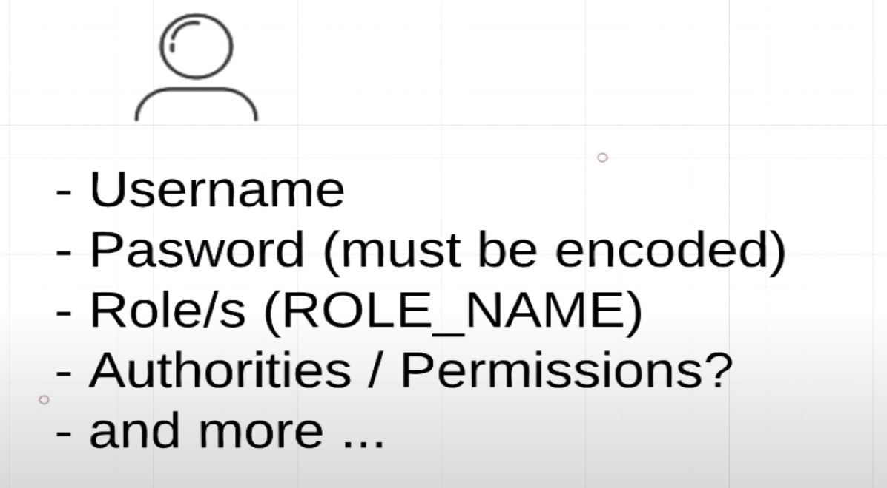

下面我们定义 **`Role`** 和 **`Permisson`** 类，其中 **一个Role是包含0个或多个permissions的**。（添加 **`com.google.guava`** 库作为依赖）

定义 **`Role`**: **`ApplicationUserRole`**

```java
// security.ApplicationUserPermission

package com.amigo.securities.security;
import com.google.common.collect.Sets;
import lombok.AllArgsConstructor;
import lombok.Getter;
import java.util.Set;
import static com.amigo.securities.security.ApplicationUserPermission.*;

@AllArgsConstructor
@Getter
public enum ApplicationUserRole {
    // 2个角色 STUDENT 和 ADMIN
    // STUDENT 没有权限
    // ADMIN 拥有COURSE_READ, COURSE_WRITE, STUDENT_READ, STUDENT_WRITE 权限
    STUDENT(Sets.newHashSet()),
    ADMIN(Sets.newHashSet(COURSE_READ, COURSE_WRITE, STUDENT_READ, STUDENT_WRITE));

    private final Set<ApplicationUserPermission> permissions;
}
```

定义 **`Permission`**: **`ApplicationUserPermission`**

```java
// security.ApplicationUserPermission
package com.amigo.securities.security;
import lombok.Getter;

public enum ApplicationUserPermission {
    STUDENT_READ("student:read"),
    STUDENT_WRITE("student:write"),
    COURSE_READ("course:read"),
    COURSE_WRITE("course:write");

    @Getter
    private final String permission;

    ApplicationUserPermission(String permission) {
        this.permission = permission;
    }
}
```

**roles 和 permissions 关系如下：**

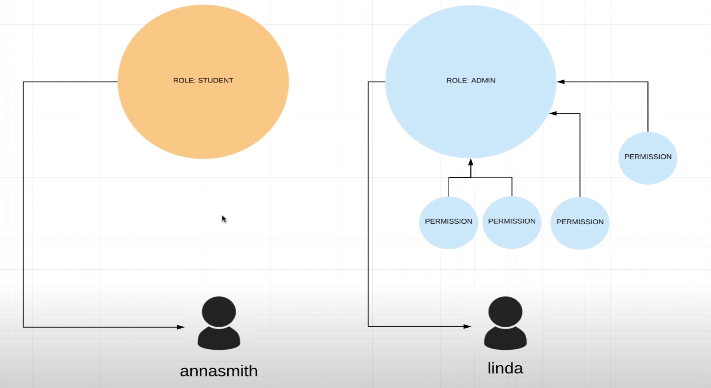

然后将定义的 **Roles 赋予给不同的 Users**:

```java
@Configuration
@EnableWebSecurity
public class ApplicationSecurityConfig extends WebSecurityConfigurerAdapter {

	// ...

    // 用于从数据库中获取用户
    @Override
    @Bean // 用于SpringBoot帮助我们自动注入
    protected UserDetailsService userDetailsService() {
        UserDetails kobeUser = User.builder()
                .username("kobe")
                .password(passwordEncoder.encode("password123"))
                .roles(ApplicationUserRole.STUDENT.name()) // student role
                .build();

        UserDetails lindaUser = User.builder()
                .username("linda")
                .password(passwordEncoder.encode("password123"))
                .roles(ApplicationUserRole.ADMIN.name()) // admin role
                .build();

        return new InMemoryUserDetailsManager(kobeUser, lindaUser);

    }
}
```


### 3.1 基于Role的接口验证(Roles based authentication)

假设我们有一个接口是 **`/api/v1/students/{studentId}`**, 我们只允许上面定义的 **`kobe`** user访问，而 **`linda`** user 是无法访问的，则我们可以使用 **`antMatchers() + hasRole() `** 的方式进行匹配：

```java
@Override
protected void configure(HttpSecurity http) throws Exception {
  // 表示 任何请求都需要验证 并且 使用 basic auth
  http
  .authorizeRequests()
  .antMatchers("/", "index", "/css/*", "/js/*").permitAll()
    // 使用接口 + 角色 对请求进行匹配 
    // roles based authentication
  .antMatchers("/api/**").hasRole(ApplicationUserRole.STUDENT.name())
  .anyRequest()
  .authenticated()
  .and()
  .httpBasic();
}
```

现在使用 **`kobe`** 访问 **`localhost:8080/api/v1/students/1`** 可以正常的返回数据，而对 **`linda`** 因为角色不匹配，返回：

```json
{
    "timestamp": "2020-10-02T10:04:55.385+00:00",
    "status": 403,
    "error": "Forbidden",
    "message": "",
    "path": "/api/v1/students/3"
}
```


### 3.2 基于Permissions的验证（Permissions based authentication）

除了上面基于 **roles** 的验证外，还可以基于 **permissions** 的验证。

假设下面添加一个 **ADMINTRAINEE** role, 它拥有 **`COURSE_READ & STUDENT_READ`** 读的权限：


```java
// com.amigo.securities.security.ApplicationSecurityConfig
// 新添加一个Role
@AllArgsConstructor
@Getter
public enum ApplicationUserRole {
    // 2个角色 STUDENT 和 ADMIN
    // STUDENT 没有权限
    // ADMIN 拥有COURSE_READ, COURSE_WRITE, STUDENT_READ, STUDENT_WRITE 权限
    // ADMINTRAINEE 只有读的权限
    STUDENT(Sets.newHashSet()),
    ADMIN(Sets.newHashSet(COURSE_READ, COURSE_WRITE, STUDENT_READ, STUDENT_WRITE)),
    ADMINTRAINEE(Sets.newHashSet(COURSE_READ, STUDENT_READ));

    private final Set<ApplicationUserPermission> permissions;
}
```

```java
// com.amigo.securities.security.ApplicationUserRole
// 新添加一个User
@Override
@Bean 
protected UserDetailsService userDetailsService() {
    // ...
		// 创建一个新用户 tom
    UserDetails tomUser = User.builder()
            .username("tom")
            .password(passwordEncoder.encode("password123"))
            .roles(ApplicationUserRole.ADMINTRAINEE.name()) // ROLE_ADMINTRAINEE
            .build();

    return new InMemoryUserDetailsManager(kobeUser, lindaUser, tomUser);

}
```

先建一个用于测试的controller, 接口为 **`management/api/v1/students`**:

```java
// com.amigo.securities.student.StudentManageController
@RestController
@RequestMapping("management/api/v1/students")
public class StudentManageController {
    private final List<Student> students = Arrays.asList(
            new Student(1, "James Leborn"),
            new Student(2, "Kobe Bryant"),
            new Student(3, "Michael Jordan")
    );
  
  
		// 查
    @GetMapping
    public List<Student> getAllStudents() {
        System.out.println("Get All Students");
        return students;
    }
  
		// 增
    @PostMapping
    public void registerNewStudent(@RequestBody Student student) {
        System.out.println("registerNewStudent " + student);
    }

  	// 删
    @DeleteMapping(path = "{studentId}")
    public void deleteStudent(@PathVariable("studentId") Integer studentId) {
        System.out.println("deleteStudent id " + studentId);
    }

  	// 改
    @PutMapping(path = "{studentId}")
    public void updateStudent(@PathVariable("studentId") Integer studentId, @RequestBody Student student) {
        System.out.printf("%s %s%n", studentId, student);
    }
}
```

现在使用 **`linda`** 访问上面的增删改查，发现只有 **`GET /management/api/v1/students`** 是可以ok的，区域的都会返回 **`403`**， 这是因为 **`csrf`** 的缘故（后面会介绍），先将其禁用：

```java
// com.amigo.securities.security.ApplicationSecurityConfig
@Override
protected void configure(HttpSecurity http) throws Exception {
  // 表示 任何请求都需要验证 并且 使用 basic auth
  http
  .csrf().disable()
  .authorizeRequests()
  .antMatchers("/", "index", "/css/*", "/js/*").permitAll()
    // 使用接口 + 角色 对请求进行匹配 
    // roles based authentication
  .antMatchers("/api/**").hasRole(ApplicationUserRole.STUDENT.name())
  .anyRequest()
  .authenticated()
  .and()
  .httpBasic();
}
```

目前为止，**`linda & tom`** user 对 **`/management/api/v1/students`** 是都可以访问的。

先使用 **`antMatchers().hasAuthority()`** 对不同的资源添加不同的权限要求：

- 对于 **`/management/api/..`** 的 **`POST & PUT & DELETE`** 请求，要求拥有 **`COURSE_WRITE`** 权限
- 对于 **`/management/api/..`** 的 **`GET`** 请求，只需要是 **`ADMIN | ADMINTRAINEE`** roles 即可

```java
// com.amigo.securities.security.ApplicationSecurityConfig
@Override
protected void configure(HttpSecurity http) throws Exception {
  // 表示 任何请求都需要验证 并且 使用 basic auth
  http
    .csrf().disable()
    .authorizeRequests()
    .antMatchers("/", "index", "/css/*", "/js/*")
    .permitAll()
    .antMatchers("/api/**").hasRole(ApplicationUserRole.STUDENT.name()) // roles based authentication
    .antMatchers(HttpMethod.POST, "/management/api/**").hasAuthority(ApplicationUserPermission.COURSE_WRITE.name())
    .antMatchers(HttpMethod.PUT, "/management/api/**").hasAuthority(ApplicationUserPermission.COURSE_WRITE.name())
    .antMatchers(HttpMethod.DELETE, "/management/api/**").hasAuthority(ApplicationUserPermission.COURSE_WRITE.name())
    .antMatchers(HttpMethod.GET, "/management/api/**").hasAnyRole(ApplicationUserRole.ADMIN.name(),
                                                                  ApplicationUserRole.ADMINTRAINEE.name())
    .anyRequest()
    .authenticated()
    .and()
    .httpBasic();
}
```

现在的关键在于，怎么将权限赋予给不同的用户，前面给用户赋予角色的方法为 **`.role()`**, 其源码如下：

```java
// com.amigo.securities.security.ApplicationSecurityConfig
public User.UserBuilder roles(String... roles) {
  List<GrantedAuthority> authorities = new ArrayList(roles.length);
  String[] var3 = roles;
  int var4 = roles.length;

  for(int var5 = 0; var5 < var4; ++var5) {
    String role = var3[var5];
    Assert.isTrue(!role.startsWith("ROLE_"), () -> {
    	return role + " cannot start with ROLE_ (it is automatically added)";
  	});
 	 	authorities.add(new SimpleGrantedAuthority("ROLE_" + role));
  }

  return this.authorities((Collection)authorities);
}
```

其本质就是将不同的 **`ROLE`** 添加到 **`authorities`** 集合中，因此我们也可以将 **`ApplicationUserRole `** 中的 **`permissions`** 添加到一个自定义的集合中, 下面使用 **`GrantedAuthority `** 接口的 **`SimpleGrantedAuthority`** 实现：

```java
// com.amigo.securities.security.ApplicationUserRole
@AllArgsConstructor
@Getter
public enum ApplicationUserRole {
    // 2个角色 STUDENT 和 ADMIN
    // STUDENT 没有权限
    // ADMIN 拥有COURSE_READ, COURSE_WRITE, STUDENT_READ, STUDENT_WRITE 权限
    // ADMINTRAINEE 只有读的权限
    STUDENT(Sets.newHashSet()),
    ADMIN(Sets.newHashSet(COURSE_READ, COURSE_WRITE, STUDENT_READ, STUDENT_WRITE)),
    ADMINTRAINEE(Sets.newHashSet(COURSE_READ, STUDENT_READ));

    private final Set<ApplicationUserPermission> permissions;

    // 自定义方法 获取不同Role 所有的 authorities
    public Set<SimpleGrantedAuthority> getGrantedAuthorities() {
        // 将Role拥有的permissions 存放到自定义的 Set<SimpleGrantedAuthority> 集合中
        Set<SimpleGrantedAuthority> permissions = getPermissions().stream()
                .map(permission -> new SimpleGrantedAuthority(permission.getPermission()))
                .collect(Collectors.toSet());
        // 将ROLE自身也添加到集合中
        permissions.add(new SimpleGrantedAuthority("ROLE_" + this.name()));
        return permissions;
    }
}
```

然后将 **`ApplicationSecurityConfig`** 中的 **`User.builder()`** 中的 **`.role()`** 方法去掉，使用 **`.authorities()`**定义user所拥有的 所有的**`authorities()`**：

```java
// com.amigo.securities.security.ApplicationSecurityConfig
@Configuration
@EnableWebSecurity
public class ApplicationSecurityConfig extends WebSecurityConfigurerAdapter {

    // 用于从数据库中获取用户
    @Override
    @Bean // 用于SpringBoot帮助我们自动注入
    protected UserDetailsService userDetailsService() {
        UserDetails kobeUser = User.builder()
                .username("kobe")
                .password(passwordEncoder.encode("password123"))
//                .roles(ApplicationUserRole.STUDENT.name()) // spring 会将roles转换成 ROLE_STUDENT
                .authorities(ApplicationUserRole.STUDENT.getGrantedAuthorities())
                .build();

        UserDetails lindaUser = User.builder()
                .username("linda")
                .password(passwordEncoder.encode("password123"))
//                .roles(ApplicationUserRole.ADMIN.name()) // ROLE_ADMIN
                .authorities(ApplicationUserRole.ADMIN.getGrantedAuthorities())
                .build();

        UserDetails tomUser = User.builder()
                .username("tom")
                .password(passwordEncoder.encode("password123"))
//                .roles(ApplicationUserRole.ADMINTRAINEE.name()) // ROLE_ADMINTRAINEE
                .authorities(ApplicationUserRole.ADMINTRAINEE.getGrantedAuthorities())
                .build();

        return new InMemoryUserDetailsManager(kobeUser, lindaUser, tomUser);

    }
}

```

通过断点，可以看出不同用户的权限：

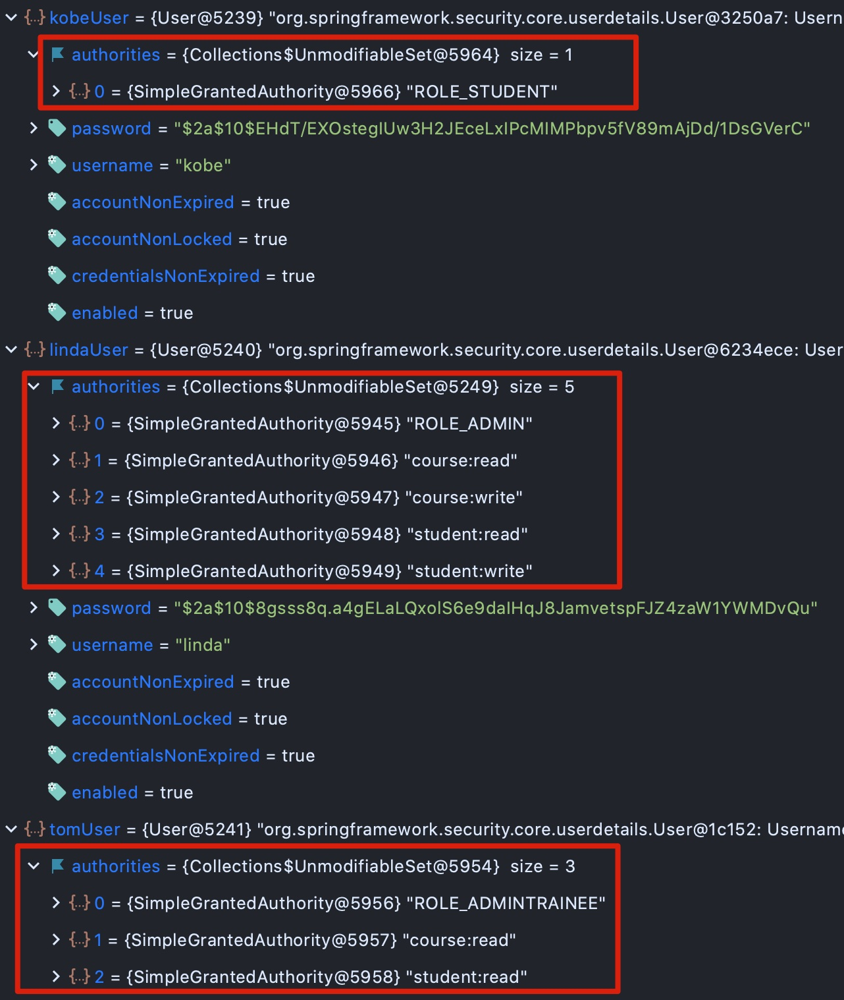

最后将 **`void configure(HttpSecurity http)`** 中的 **`hasAuthority()`** 从 **`name()`** 更改为 **`getPermission()`**:

```java
// com.amigo.securities.security.ApplicationSecurityConfig
@Override
protected void configure(HttpSecurity http) throws Exception {
  // 表示 任何请求都需要验证 并且 使用 basic auth
  http
    .csrf().disable()
    .authorizeRequests()
    .antMatchers("/", "index", "/css/*", "/js/*")
    .permitAll()
    .antMatchers("/api/**").hasRole(ApplicationUserRole.STUDENT.name()) // roles based authentication
    .antMatchers(HttpMethod.POST, "/management/api/**").hasAuthority(ApplicationUserPermission.COURSE_WRITE.getPermission())
    .antMatchers(HttpMethod.PUT, "/management/api/**").hasAuthority(ApplicationUserPermission.COURSE_WRITE.getPermission())
    .antMatchers(HttpMethod.DELETE, "/management/api/**").hasAuthority(ApplicationUserPermission.COURSE_WRITE.getPermission())
    .antMatchers(HttpMethod.GET, "/management/api/**").hasAnyRole(ApplicationUserRole.ADMIN.name(),                                                             ApplicationUserRole.ADMINTRAINEE.name())
    .anyRequest()
    .authenticated()
    .and()
    .httpBasic();
}
```

现在用户 **`tom`** 只能对 **`management/api/..`** 进行 **`GET`** 请求（即读操作），而用户 **`linda`** 则即可读也可以写。


#### 3.2.1 使用基于注解的验证 PreAuthorize()

- 对应分支05: [05_authority_using_annotaion_preAuthorize](https://github.com/jamessawyer/spring-security/commits/05_authority_using_annotaion_preAuthorize)

- 对应视频： [1:51:11](https://www.youtube.com/watch?v=her_7pa0vrg&t=6671s) - preAuthorize()

上面的使用 **`antMatchers() + hasRole() | hasAuthority() |hasAnyRole() | hasAnyAuthority()  `** 模式匹配的方式，对不同接口使用不同的访问权限。在Spring-Security中，提供了基于 **方法** 的注解 **`@PreAuthorize()`** 进行鉴权。

上面的示例可以写为：

```java
// com.amigo.securities.student.StudentManageController

@RestController
@RequestMapping("management/api/v1/students")
public class StudentManageController {
    private final List<Student> students = Arrays.asList(
            new Student(1, "James Leborn"),
            new Student(2, "Kobe Bryant"),
            new Student(3, "Michael Jordan")
    );

    @GetMapping
  	// 或者写为
    // @PreAuthorize("hasRole('ADMIN') OR hasRole('ADMINTRAINEE')")
    @PreAuthorize("hasAnyRole('ADMIN', 'ADMINTRAINEE')")
    public List<Student> getAllStudents() {
        System.out.println("Get All Students");
        return students;
    }

    @PostMapping
    @PreAuthorize("hasAuthority('student:write')")
    public void registerNewStudent(@RequestBody Student student) {
        System.out.println("registerNewStudent " + student);
    }

    @DeleteMapping(path = "{studentId}")
    @PreAuthorize("hasAuthority('student:write')")
    public void deleteStudent(@PathVariable("studentId") Integer studentId) {
        System.out.println("deleteStudent id " + studentId);
    }

    @PutMapping(path = "{studentId}")
    @PreAuthorize("hasAuthority('student:write')")
    public void updateStudent(@PathVariable("studentId") Integer studentId, @RequestBody Student student) {
        System.out.printf("%s %s%n", studentId, student);
    }
}
```

**`@PreAuthority`** 和 **`antMatchers() `** 一样，可以使用  **`hasRole() | hasAuthority() |hasAnyRole() | hasAnyAuthority()  `** 进行模式匹配。

另外还需要在 **`ApplicationSecurityConfig`** 中将 **`@EnableGlobalMethodSecurity()`** 开启

```java
// com.amigo.securities.security.ApplicationSecurityConfig
@Configuration
@EnableWebSecurity
@EnableGlobalMethodSecurity(prePostEnabled = true) // 开启
public class ApplicationSecurityConfig extends WebSecurityConfigurerAdapter {

    @Override
    protected void configure(HttpSecurity http) throws Exception {
        http
            .csrf().disable()
            .authorizeRequests()
                .antMatchers("/", "index", "/css/*", "/js/*")
                    .permitAll()
                .antMatchers("/api/**").hasRole(ApplicationUserRole.STUDENT.name()) // roles based authentication
//                .antMatchers(HttpMethod.POST, "/management/api/**").hasAuthority(ApplicationUserPermission.COURSE_WRITE.getPermission())
//                .antMatchers(HttpMethod.PUT, "/management/api/**").hasAuthority(ApplicationUserPermission.COURSE_WRITE.getPermission())
//                .antMatchers(HttpMethod.DELETE, "/management/api/**").hasAuthority(ApplicationUserPermission.COURSE_WRITE.getPermission())
//                .antMatchers(HttpMethod.GET, "/management/api/**").hasAnyRole(ApplicationUserRole.ADMIN.name(),
//                ApplicationUserRole.ADMINTRAINEE.name())
            .anyRequest()
            .authenticated()
            .and()
            .httpBasic();
    }

}
```

去掉 **`antMatchers`** 部分， 这样就和上面的一模一样了。


## 4. Form Auth（表单验证）

- 对应分支06: [06_form_auth ](https://github.com/jamessawyer/spring-security/commits/06_form_auth)
- 对应视频：[2:14:10](https://www.youtube.com/watch?v=her_7pa0vrg&t=8050s) - FORM BASED AUTHENTICATION

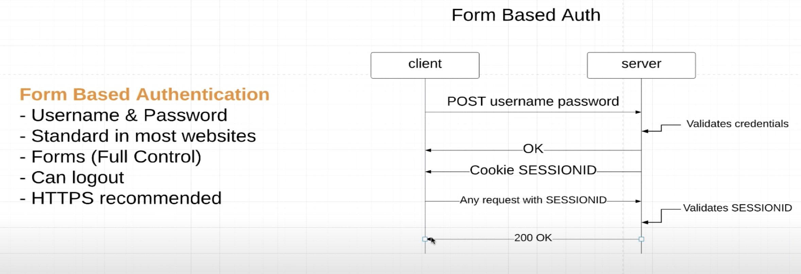

基于表单验证的特点：

- 需要用户名和密码
- 很多网站都使用
- 能够退出登录

**流程**：

1. 客户端携带用户名和密码登录
2. 服务端验证用户存在，密码正确后，发送 **`Cookie SessionID`** 给客户端，服务端会将这个session保存在内存中（也可以选在保存在Redis或者数据库中）,如果保存在内存中，默认这个session将在 **`30`分钟** 过期
3. 客户端会将这个 **`Cookie SeesionID`** 自动存储下来（比如浏览器存储在 Application->Storage->Cookies中）,比如 key为：**`JSESSIONID`**, value为：**`2BEE335DD2AD7BE9ABCC40FE2176EE63`**
4. 客户端每次发送请求的时候，会在请求头重 **自动** 携带这个`SessionID`，比如 **`Cookie:night=1; JSESSIONID=2BEE335DD2AD7BE9ABCC40FE2176EE63`**
5. 服务端验证SessionID是否有效，如果有效则返回200，无效则返回403

缺点：

1. 移动端一般禁用会Cookie
2. cookie有大小限制，最大4k
3. cookie不能跨域


### 4.1 表单验证使用方法

将上面的 **`httpBasic()`** 换成 **`formLogin()`** 即可：

```java
// com.amigo.securities.security.ApplicationSecurityConfig
@Override
protected void configure(HttpSecurity http) throws Exception {
  // 表示 任何请求都需要验证 并且 使用 basic auth
  http
    .csrf().disable()
    .authorizeRequests()
    .antMatchers("/", "index", "/css/*", "/js/*")
    .permitAll()
    .anyRequest()
    .authenticated()
    .and()
    .formLogin();
}
```

默认sprintboot会提供一个登录界面，如果想自定义，可以按照以下步骤：

1. 添加 **`spring-boot-starter-thymeleaf`** 依赖，java html模版引擎

   ```xml
   <dependency>
   	<groupId>org.springframework.boot</groupId>
   	<artifactId>spring-boot-starter-thymeleaf</artifactId>
   </dependency>
   ```

2. 在 **`resources/templates`** 目录下新建 `login.html` 页面，并输入自己想要的表单内容

3. 新建一个 `controller`, 用于处理 `login` 页面请求

   ```java
   @Controller
   @RequestMapping("/")
   public class TempalateController {
       @GetMapping("login")
       public String getLoginView() {
           return "login"; // 返回login页面
       }
   }
   ```

4. 在 `ApplicationSecurityConfig` 配置中添加 **`.loginPage("/login").permitAll()`** :

   ```java
   // com.amigo.securities.security.ApplicationSecurityConfig
   @Override
   protected void configure(HttpSecurity http) throws Exception {
     // 表示 任何请求都需要验证 并且 使用 basic auth
     http
       ...
       .formLogin()
       	.loginPage("/login")
       	.permitAll();
   }
   ```

登录成功后，默认会跳转到 **`index.html`** 页面，即 **`/`** 路径


### 4.2 自定义表单登录成功后的逻辑

如果想要自定义跳转页面，可以使用 **`defaultSuccessUrl`**:

```java
// com.amigo.securities.security.ApplicationSecurityConfig
@Override
protected void configure(HttpSecurity http) throws Exception {
  // 表示 任何请求都需要验证 并且 使用 basic auth
  http
    ...
    .formLogin()
    	.loginPage("/login")
    	.permitAll()
    	.defaultSuccessUrl("/courses", true);
}
```

这里会新建一个 **`courses.html`** 已经相应的controller:

```java
@Controller
@RequestMapping("/")
public class TempalateController {
    // ...
    @GetMapping("courses")
    public String getCoursesView() {
        return "courses";
    }
}
```

另外如果有自定义逻辑，还可以使用 **`successHandler(AuthenticationSuccessHandler successHandler) `**：

```java
// com.amigo.securities.security.ApplicationSecurityConfig
@Override
protected void configure(HttpSecurity http) throws Exception {
  // 表示 任何请求都需要验证 并且 使用 basic auth
  http
    ...
    .formLogin()
    	.loginPage("/login")
    	.permitAll()
    	.successHandler(someSuccessHandler);
}
```


### 4.3 记住密码 Remeber-me

在configure中添加 **`rememberMe()`**:

```java
// com.amigo.securities.security.ApplicationSecurityConfig
@Override
protected void configure(HttpSecurity http) throws Exception {
  // 表示 任何请求都需要验证 并且 使用 basic auth
  http
    ...
    .formLogin()
    	.loginPage("/login")
    	.permitAll()
    	.successHandler(someSuccessHandler)
    	.and()
    	.rememberMe();
}
```

首先在 `login.html` 中添加一个这样的checkbox:

```html
<p class="block">
	<label for="remember-me">记住密码？</label>
	<input type="checkbox" id="remember-me" name="remember-me" class="form-control">
</p>
```

登录的时候，如果勾选 **记住密码** 会发现，**表单数据**为：

```
username: linda
password: password123
remember-me: on
```

原理：

- 服务端会像返回 `Cookie` 一样返回一个 **`remember-me`** 的md5 hash值给客户端
- 这个hash值包含 **`username`** 和过期时间 `expiration time`
- 默认过期时间是 `2 weeks`, 2个星期

**服务端默认会将这个 `remember-me` 保存在内存中**, 如果像自定义到数据库或者redis中，可以使用：

```java
.rememberMe()
.tokenRepository(PersistentTokenRepository tokenRepository)
```

自定义过期时间：

```java
.rememberMe()
.tokenValiditySeconds(int tokenValiditySeconds)
```

比如：

```java
.rememberMe()
	.tokenValiditySeconds((int) TimeUnit.DAYS.toSeconds(21))
	.key("your_custom_secret_key_for_md5_hash"); // 用于加密的key 可以自定义
```


### 4.4 自定义password,username remember-me参数

上面的表单中使用的都是默认的表单参数，例如 **`login.html`**:

```html
<form class="form-signin" method="post" action="/login">
	<h2 class="form-signin-heading">请登录</h2>
  <p>
  	<label for="username" class="sr-only">用户名</label>
  	<input type="text" id="username" name="username" class="form-control" placeholder="Username" required="" autofocus="">
  </p>
  <p>
  	<label for="password" class="sr-only">密码</label>
  	<input type="password" id="password" name="password" class="form-control" placeholder="Password" required="">
  </p>
  <p class="block">
    <label for="remember-me">记住密码？</label>
    <input type="checkbox" id="remember-me" name="remember-me" class="form-control">
  </p>
	<button class="btn btn-lg btn-primary btn-block" type="submit">登录</button>
</form>
```

上面的表单 `name` 属性，都是按照默认提供的，也可以自定义：

```java
.formLogin()
	.loginPage("/login")
	.permitAll()
	.defaultSuccessUrl("/courses", true)
	.passwordParameter("password") // 可以自定义password name
	.usernameParameter("username") // 可以自定义username name
.and()
.rememberMe()
	.tokenValiditySeconds((int) TimeUnit.DAYS.toSeconds(21))
	.key("your_custom_secret_key_for_md5_hash")
	.rememberMeParameter("remember-me") // 可以自定义remember-me name
```


### 4.5 表单logout 退出登录

当前我们退出登录，都是直接在浏览器中输入 **`localhost:8080/logout`** 退出的，spring security也提供了退出登录的配置：

```java
// com.amigo.securities.security.ApplicationSecurityConfig
@Override
protected void configure(HttpSecurity http) throws Exception {
  // 表示 任何请求都需要验证 并且 使用 basic auth
  http
    .csrf().disable()
    ...
    .formLogin()
    	.loginPage("/login")
    	.permitAll()
    	.successHandler(someSuccessHandler)
    	.and()
    	.rememberMe()
    		.tokenValiditySeconds((int) TimeUnit.DAYS.toSeconds(21))
    		.key("your_custom_secret_key_for_md5_hash")
    	.and()
    	.logout()
        .logoutUrl("/logout")
        .logoutRequestMatcher(new AntPathRequestMatcher("/logout", "GET"))
        .clearAuthentication(true)
        .invalidateHttpSession(true)
        .deleteCookies("JSESSIONID", "remember-me")
        .logoutSuccessUrl("/login");
}
```

有一点需要注意的是：

- 如果 **`http.csrf().disable()`**, **`logoutUrl("/logout")`** 则退出登录可以是任意方法 **`GET|POST`**
- 如果 **`csrf()`** 是开启的，则只能使用 **`POST`** 退出登录， 上面的 **`.logoutRequestMatcher(new AntPathRequestMatcher("/logout", "GET"))`** 需要删除掉


**添加退出按钮**：

在上面的 `courses.html` 中添加：

```html
<div class="container">
    <h1>Courses list</h1>
    <form class="form-signout" method="get" action="/logout">
        <button class="btn btn-sm btn-primary btn-block" type="submit">退出登录</button>
    </form>
</div>
```

因为上面的 `csrf().disable()`, 所以这里的表单方法是 `get`.

点击退出登录按钮后，页面会跳转到上面定义的 `.logoutSuccessUrl("/login")` 登录页面


##  5. DB Authentication （数据库验证）

- 对应分支07: [07_db_authentication](https://github.com/jamessawyer/spring-security/commits/07_db_authentication)
- 对应视频：[3:00:29](https://www.youtube.com/watch?v=her_7pa0vrg&t=10829s) - DB AUTHENTICATION OVERVIEW

上面的用户都存储在 **`InMemoryUserDetailsManager`** 内存中，实际项目中，一般将用户数据存储在数据库中。

其架构如下：

 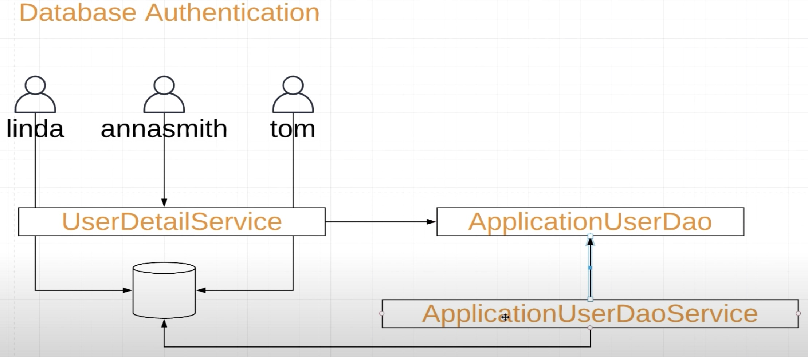

使用DB验证，则需要


### 5.1 实现 **`UserDetails`** 接口：

```java
public interface UserDetails extends Serializable {
    Collection<? extends GrantedAuthority> getAuthorities();
    String getPassword();
    String getUsername();
    boolean isAccountNonExpired();
    boolean isAccountNonLocked();
    boolean isCredentialsNonExpired();
    boolean isEnabled();
}
```

自定义一个类：**`ApplicationUser`**:

```java
// com.amigo.securities.auth.ApplicationUser
package com.amigo.securities.auth;

import org.springframework.security.core.GrantedAuthority;
import org.springframework.security.core.userdetails.UserDetails;

import java.util.Collection;
import java.util.List;
import java.util.Set;

public class ApplicationUser implements UserDetails {
    private final String username;
    private final String password;
    private final Set<? extends GrantedAuthority> grantedAuthorities;
    private final Boolean isAccountNonExpired;
    private final Boolean isAccountNonLocked;
    private final Boolean isCredentialsNonExpired;
    private final Boolean isEnabled;

    public ApplicationUser(
            String username,
            String password,
            Set<? extends GrantedAuthority> grantedAuthorities,
            Boolean isAccountNonExpired,
            Boolean isAccountNonLocked,
            Boolean isCredentialsNonExpired,
            Boolean isEnabled
    ) {
        this.grantedAuthorities = grantedAuthorities;
        this.password = password;
        this.username = username;
        this.isAccountNonExpired = isAccountNonExpired;
        this.isAccountNonLocked = isAccountNonLocked;
        this.isCredentialsNonExpired = isCredentialsNonExpired;
        this.isEnabled = isEnabled;
    }

    @Override
    public Collection<? extends GrantedAuthority> getAuthorities() {
        return grantedAuthorities;
    }

    @Override
    public String getPassword() {
        return password;
    }

    @Override
    public String getUsername() {
        return username;
    }

    @Override
    public boolean isAccountNonExpired() {
        return isAccountNonExpired;
    }

    @Override
    public boolean isAccountNonLocked() {
        return isAccountNonLocked;
    }

    @Override
    public boolean isCredentialsNonExpired() {
        return isCredentialsNonExpired;
    }

    @Override
    public boolean isEnabled() {
        return isEnabled;
    }
}
```


### 5.2 Dao层 （接口层，提供抽象）

提供一个接口，这样具体的实现则可以多样化，而不用改变其它逻辑

```java
// com.amigo.securities.auth.ApplicationUserDao
public interface ApplicationUserDao {
    public Optional<ApplicationUser> selectApplicationUserByUsername(String username);
}
```


### 5.3 实现 **UserDetailsService** 接口

这个用来代理我们用户去数据库查询用户信息

```java
public interface UserDetailsService {
    UserDetails loadUserByUsername(String var1) throws UsernameNotFoundException;
}
```

实现类：

```java
// com.amigo.securities.auth.ApplicationUserService
@Service
public class ApplicationUserService implements UserDetailsService {
    private final ApplicationUserDao applicationUserDao;

    public ApplicationUserService(ApplicationUserDao applicationUserDao) {
        this.applicationUserDao = applicationUserDao;
    }

    @Override
    public UserDetails loadUserByUsername(String username) throws UsernameNotFoundException {
        return applicationUserDao
                .selectApplicationUserByUsername(username)
                .orElseThrow(() -> new UsernameNotFoundException(String.format("username %s not found", username)));
    }
}
```

这里会报错，因为没有 `ApplicationUserDao` 的实现类可以被注入，下面完成`ApplicationUserDao` 的实现类


### 5.4 实现层，查询数据库

```java
// com.amigo.securities.auth.FakeApplicationUserDaoService
@Repository("fake")
public class FakeApplicationUserDaoService implements ApplicationUserDao {
    private final PasswordEncoder passwordEncoder;

    @Autowired
    public FakeApplicationUserDaoService(PasswordEncoder passwordEncoder) {
        this.passwordEncoder = passwordEncoder;
    }

    @Override
    public Optional<ApplicationUser> selectApplicationUserByUsername(String username) {
        return getApplicationUsers()
                .stream()
                .filter(user -> username.equals(user.getUsername()))
                .findFirst();
    }

    // 假设这是用户数据库
    private List<ApplicationUser> getApplicationUsers() {
        List<ApplicationUser> applicationUsers = Lists.newArrayList(
                new ApplicationUser(
                        "kobe",
                        passwordEncoder.encode("123"),
                        ApplicationUserRole.STUDENT.getGrantedAuthorities(),
                        true,
                        true,
                        true,
                        true
                ),
                new ApplicationUser(
                        "linda",
                        passwordEncoder.encode("123"),
                        ApplicationUserRole.ADMIN.getGrantedAuthorities(),
                        true,
                        true,
                        true,
                        true
                ),
                new ApplicationUser(
                        "tom",
                        passwordEncoder.encode("123"),
                        ApplicationUserRole.ADMINTRAINEE.getGrantedAuthorities(),
                        true,
                        true,
                        true,
                        true
                )

        );
        return applicationUsers;
    }
}
```

实现的方式有很多种，**`@Repository("fake")`** 中的 `fake`, 表示这个实现类的名字，**如果只有一个实现类，则这个可以省略。**

修正上面的 **`ApplicationUserService`** ，注入正确的实现类：**`@Qualifier("fake")`** 表示这里注入的是 `FakeApplicationUserDaoService` 

```java
// com.amigo.securities.auth.ApplicationUserService
@Service
public class ApplicationUserService implements UserDetailsService {

    private final ApplicationUserDao applicationUserDao;

    @Autowired
    public ApplicationUserService(@Qualifier("fake") ApplicationUserDao applicationUserDao) {
        this.applicationUserDao = applicationUserDao;
    }

    @Override
    public UserDetails loadUserByUsername(String username) throws UsernameNotFoundException {
        return applicationUserDao
                .selectApplicationUserByUsername(username)
                .orElseThrow(() -> new UsernameNotFoundException(String.format("username %s not found", username)));
    }
}
```


### 5.5 使用上面定义的DaoService

之前一直在 `ApplicationSecurityConfig` 使用的是 `UserDetailsService userDetailsService()` 使用的内存中数据，现在使用数据库数据，则这个方法不再需要，而是需要实现 **`configure(AuthenticationManagerBuilder auth)`**

即第一步，删除：

```java
 @Override
@Bean // 用于SpringBoot帮助我们自动注入
protected UserDetailsService userDetailsService() {
  UserDetails kobeUser = User.builder()
    .username("kobe")
    .password(passwordEncoder.encode("123"))
    //                .roles(ApplicationUserRole.STUDENT.name()) // spring 会将roles转换成 ROLE_STUDENT
    .authorities(ApplicationUserRole.STUDENT.getGrantedAuthorities())
    .build();

  // ...
  return new InMemoryUserDetailsManager(kobeUser, lindaUser, tomUser);
}
```

第二步，实现 `configure(AuthenticationManagerBuilder auth)`：

```java
// com.amigo.securities.security.ApplicationSecurityConfig
@Configuration
@EnableWebSecurity
@EnableGlobalMethodSecurity(prePostEnabled = true)
public class ApplicationSecurityConfig extends WebSecurityConfigurerAdapter {

    private final PasswordEncoder passwordEncoder;
    private final ApplicationUserService applicationUserService;

    @Autowired
    public ApplicationSecurityConfig(
    	PasswordEncoder passwordEncoder,
    	ApplicationUserService applicationUserService
    ) {
        this.passwordEncoder = passwordEncoder;
        this.applicationUserService = applicationUserService;
    }

    @Override
    protected void configure(HttpSecurity http) throws Exception {
        // ...
    }
  
  	@Override
    protected void configure(AuthenticationManagerBuilder auth) throws Exception {
       auth.authenticationProvider(daoAuthenticationProvider());
    }

    public DaoAuthenticationProvider daoAuthenticationProvider() {
        DaoAuthenticationProvider provider = new DaoAuthenticationProvider();
        provider.setPasswordEncoder(passwordEncoder);
        provider.setUserDetailsService(applicationUserService);
        return provider;
    }

  // 1.删除
    // 用于从数据库中获取用户
//    @Override
//    @Bean // 用于SpringBoot帮助我们自动注入
//    protected UserDetailsService userDetailsService() {
//        UserDetails kobeUser = User.builder()
//                .username("kobe")
//                .password(passwordEncoder.encode("123"))
////                .roles(ApplicationUserRole.STUDENT.name()) // spring 会将roles转换成 ROLE_STUDENT
//                .authorities(ApplicationUserRole.STUDENT.getGrantedAuthorities())
//                .build();
//
//        UserDetails lindaUser = User.builder()
//                .username("linda")
//                .password(passwordEncoder.encode("123"))
////                .roles(ApplicationUserRole.ADMIN.name()) // ROLE_ADMIN
//                .authorities(ApplicationUserRole.ADMIN.getGrantedAuthorities())
//                .build();
//
//        UserDetails tomUser = User.builder()
//                .username("tom")
//                .password(passwordEncoder.encode("123"))
////                .roles(ApplicationUserRole.ADMINTRAINEE.name()) // ROLE_ADMINTRAINEE
//                .authorities(ApplicationUserRole.ADMINTRAINEE.getGrantedAuthorities())
//                .build();
//
//        return new InMemoryUserDetailsManager(kobeUser, lindaUser, tomUser);
//
//    }
     
}
```

完成这些后,进行测试：

1. 登录用户 `kobe`, 他只有一个权限 `ROLE_STUDENT`, 因此他访问 `api/v1/students/{id}` 正常，访问 `management/api/v1/students` 403错误
2. 退出登录 kobe用户，登录 `linda`, 她是一个管理员，但是因为 .antMatchers("/api/、**").hasRole(ApplicationUserRole.STUDENT.name()) ，只有 `ROLE_STUDENT` 才能访问改接口，访问 `management/api/v1/students` 正常， 访问 `api/v1/students/{id}` 403，linda还可以做一些增删的工作


## 6. JWT

- 对应分支08: [08_jwt_auth](https://github.com/jamessawyer/spring-security/commits/08_jwt_auth)
- 对应视频：[3:35:24](https://www.youtube.com/watch?v=her_7pa0vrg&t=12924s) - INTRO TO JSON WEB TOKEN (JWT)

特点：

- 无状态，不需要服务端存储session
- 可以被多个不同服务使用，比如移动端，PC，第三方认证
- token只是简单的base64,因此不要将密码等信息存储在里面

缺点：

- token一旦签发，在其有效期内，可能被盗用


其认证流程：

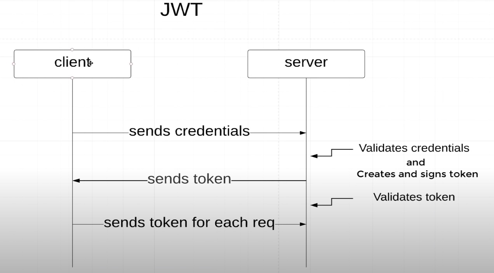

过程：

1. 客户端发送用户名和密码
2. 服务端验证用户名和密码，如果有效，服务端 **签发token**，发送给客户端 （🌿）
3. 客户端收到token，将其存储起来（比如浏览器存储在localStorage中）
4. 客户端发送需要认证的接口，在 **请求头 `Authentication` 添加token** （或者 `Bearer $token` 这种形式）（🌿）
5. 服务端接收到token， **认证接受到的token**，如果token有效，则允许访问资源


### 6.1 添加依赖

java中jwt的实现有好几个库，用的比较多的就是 [jjwt](https://github.com/jwtk/jjwt)

```xml
<dependency>
  <groupId>io.jsonwebtoken</groupId>
  <artifactId>jjwt-api</artifactId>
  <version>0.11.2</version>
</dependency>
<dependency>
  <groupId>io.jsonwebtoken</groupId>
  <artifactId>jjwt-impl</artifactId>
  <version>0.11.2</version>
  <scope>runtime</scope>
</dependency>
<dependency>
  <groupId>io.jsonwebtoken</groupId>
  <artifactId>jjwt-jackson</artifactId> <!-- or jjwt-gson if Gson is preferred -->
  <version>0.11.2</version>
  <scope>runtime</scope>
</dependency>
```

整个验证的内部逻辑图：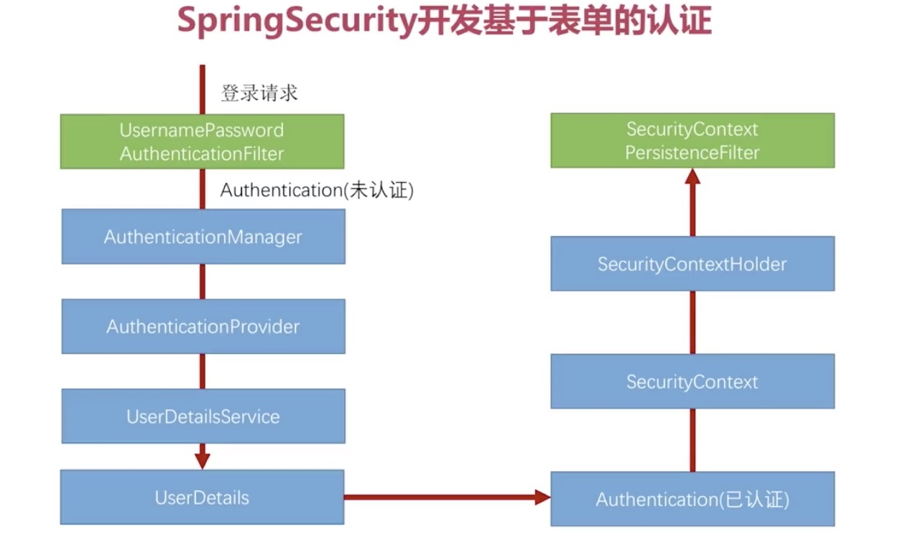


### 6.2 验证用户名和密码 Fileter

这一步表示服务端接收用户信息，然后服务端进行验证。

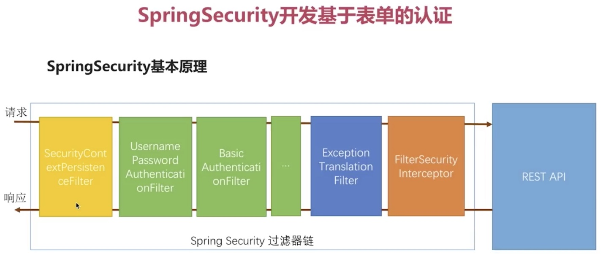

创建一个 `JwtUsernameAndPasswordAuthenticationFilter` 类，继承 `UsernamePasswordAuthenticationFilter`, 复写 `attemptAuthentication`方法，表示尝试验证

```java
// com.amigo.securities.jwt.JwtUsernameAndPasswordAuthenticationFilter
public class JwtUsernameAndPasswordAuthenticationFilter extends UsernamePasswordAuthenticationFilter {
    private final AuthenticationManager authenticationManager;

    public JwtUsernameAndPasswordAuthenticationFilter(AuthenticationManager authenticationManager) {
        this.authenticationManager = authenticationManager;
    }

    @Override
    public Authentication attemptAuthentication(
            HttpServletRequest request,
            HttpServletResponse response
    ) throws AuthenticationException {
        try {
            UsernameAndPasswordAuthenticationRequest authenticationRequest =
                new ObjectMapper().readValue(request.getInputStream(), UsernameAndPasswordAuthenticationRequest.class);

            // UsernamePasswordAuthenticationToken(Object principal, Object credentials)
            // username 表示 principal, password credentials
            // UsernamePasswordAuthenticationToken 是 Authentication接口的实现类
            Authentication authenticationToken = new UsernamePasswordAuthenticationToken(
                    authenticationRequest.getUsername(),
                    authenticationRequest.getPassword()
            );

            // 使用 authenticationManager.authenticate 方法
            Authentication authenticate = authenticationManager.authenticate(authenticationToken);
            return authenticate;
        } catch (IOException e) {
            throw new RuntimeException(e);
        }
    }
}
```

其中 `UsernameAndPasswordAuthenticationRequest` 表示用户请求模型：

```java
// com.amigo.securities.jwt.UsernameAndPasswordAuthenticationRequest
// 表示客户端发送请求中携带的用户名和密码
@NoArgsConstructor
@Getter
@Setter
public class UsernameAndPasswordAuthenticationRequest {
    private String username;
    private String password;
}
```


### 6.3 生成token 并且发送给客户端

还是在上面的 `JwtUsernameAndPasswordAuthenticationFilter` 类中，复写 `successfulAuthentication`方法，表示 `attemptAuthentication`方法验证成功后：

```java
// com.amigo.securities.jwt.JwtUsernameAndPasswordAuthenticationFilter
public class JwtUsernameAndPasswordAuthenticationFilter extends UsernamePasswordAuthenticationFilter {
    // ,,,

    @Override
    public Authentication attemptAuthentication(
            HttpServletRequest request,
            HttpServletResponse response
    ) throws AuthenticationException {
      // ...
    }

    @Override
    protected void successfulAuthentication(
            HttpServletRequest request,
            HttpServletResponse response,
            FilterChain chain,
            Authentication authResult
    ) throws IOException, ServletException {
        // 什么key都可以 确保安全 不要泄漏
        String key = "whatever---you***want***just***be**security";

        String token = Jwts.builder()
                // 下面都是添加到JWT payload 中的信息
                .setSubject(authResult.getName())
                .claim("authorities", authResult.getAuthorities()) // 添加权限信息
                .setIssuedAt(new Date()) // 签发时间
                .setExpiration(java.sql.Date.valueOf(LocalDate.now().plusWeeks(2))) // 设置过期时间为2个星期
                .signWith(Keys.hmacShaKeyFor(key.getBytes())) // 加密 key
                .compact();

        // 将生成的token 发送给客户端
        // 一般会通过返回值的形式，这里为了演示，将其添加到header中返回
        response.addHeader("Authentication", "Bearer " + token);
    }
}
```

### 6.4 添加Filter和设置无状态

**`Filter`** 类似于expressjs中的 **中间件**， 可以一层一层的对 **`HttpServletRequest request | HttpServletResponse response`** 进行拦截，另外如果一个filter想要传递给下一个filter，则需要调用 **`FilterChain chain`** 的 **`doFilter`** 方法，这个就类似expressjs中间件中的 **`next()`**。

修改 **`ApplicationSecurityConfig`** 中的配置：

```java
@Override
protected void configure(HttpSecurity http) throws Exception {
  http
    .csrf().disable()
    .sessionManagement()
    	// 设置为无状态 表示服务端不用存储session
    	.sessionCreationPolicy(SessionCreationPolicy.STATELESS) 
    .and()
    // authenticationManager 来自 WebSecurityConfigurerAdapter
    .addFilter(new JwtUsernameAndPasswordAuthenticationFilter(authenticationManager()))
    .authorizeRequests()
    .antMatchers("/", "index", "/css/*", "/js/*").permitAll()
    .antMatchers("/api/**").hasRole(ApplicationUserRole.STUDENT.name())
    .anyRequest()
    .authenticated();
}
```

设置完这些后，即可以使用Postman进行测试：

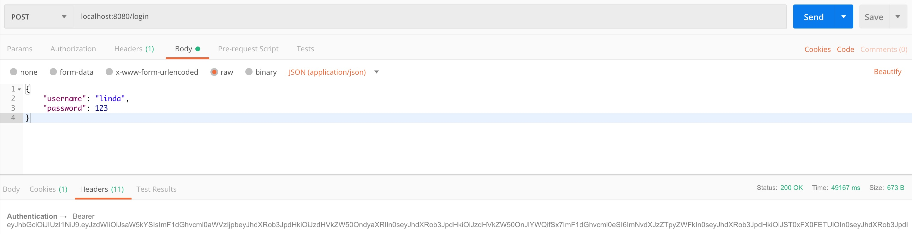

可以发现成功的返回了token.可以使用 [https://jwt.io/](https://jwt.io/) 查看payload中包含的内容：

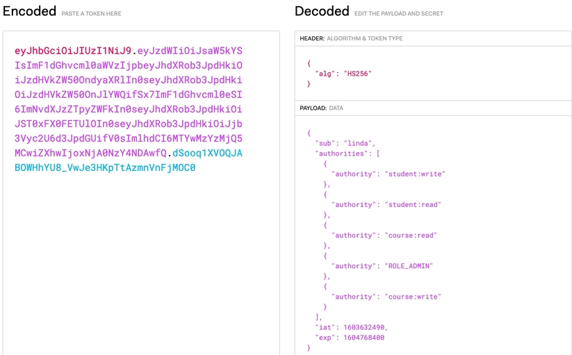


### 6.5 JwtTokenVerifier 检验Token是否有效

上面是服务端验证用户信息，然后生成token，发送给客户端的过程，下面就是 **客户端携带token发送请求，服务端对token的有效性进行验证，这里依旧使用 `filter`**

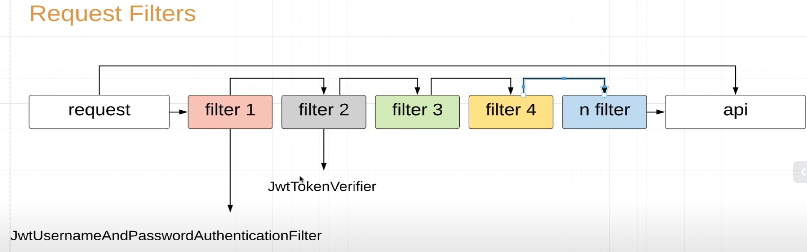

```java
// com.amigo.securities.jwt.JwtTokenVerifier
public class JwtTokenVerifier extends OncePerRequestFilter {
    @Override
    protected void doFilterInternal(
            HttpServletRequest request,
            HttpServletResponse response,
            FilterChain chain
    ) throws ServletException, IOException {
        // 得到客户端请求头中的 Authentication
        String authenticationHeader = request.getHeader("Authentication");
        String secretKey = "whatever---you***want***just***be**security";

        if (Strings.isNullOrEmpty(authenticationHeader) || !authenticationHeader.startsWith("Bearer ")) {
            // 如果为空 或者不是以 `Bearer ` 开头的 则说明不包含Authentication
            chain.doFilter(request, response); // 直接传给下一个filter处理（如果存在的话）
            // 一般这里都会返回 403 给客户端
            return;
        }

        try {
            // 将"Bearer "去掉得到真正的token
            String token = authenticationHeader.replace("Bearer ", "");

            Jws<Claims> claimsJws = Jwts.parserBuilder()
                    .setSigningKey(Keys.hmacShaKeyFor(secretKey.getBytes()))
                    .build()
                    .parseClaimsJws(token);
            Claims body = claimsJws.getBody();
            String username = body.getSubject(); // 之前签发token时将username设置到了subject中,现在取回
            // 取回jwt payload中的 `authorities` 字段
            var authorities = (List<Map<String, String>>) body.get("authorities");

            Set<SimpleGrantedAuthority> simpleGrantedAuthorities = authorities.stream()
                    .map(m -> new SimpleGrantedAuthority(m.get("authority")))
                    .collect(Collectors.toSet());

            // UsernamePasswordAuthenticationToken(Object principal, Object credentials, Collection<? extends GrantedAuthority> authorities)
            Authentication authentication = new UsernamePasswordAuthenticationToken(
                    username,
                    null,
                    simpleGrantedAuthorities
            );

            // 验证
            SecurityContextHolder.getContext().setAuthentication(authentication);

        } catch (JwtException e) {
            // 一般这里都会返回 403 给客户端
          	// 或者使用全局异常捕获
            throw new IllegalStateException("无效Token");
        }
        // 把filter后的结果传递给下一个filter 类似expressjs中的中间件
        chain.doFilter(request, response);
    }
}
```

然后将这个filter添加到配置中：

```java
 @Override
protected void configure(HttpSecurity http) throws Exception {
  http
    ...
    // authenticationManager 来自 WebSecurityConfigurerAdapter
    .addFilter(new JwtUsernameAndPasswordAuthenticationFilter(authenticationManager()))
    // 添加到JwtUsernameAndPasswordAuthenticationFilter之后
    .addFilterAfter(new JwtTokenVerifier(), JwtUsernameAndPasswordAuthenticationFilter.class)
    ...
    .authenticated();
}
```

使用Postman 进行测试：

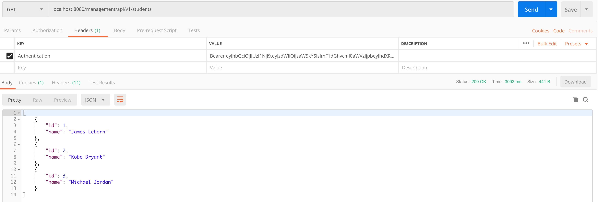

如果token错误，则会返回 **`403 Forbbiden`**


### 6.6 配置文件（可选步骤）

为了方便管理，一般会将一些常量以配置的形式进行管理。比如这里的：

- **secretKey**
- **tokenPrefix**
- tokenExpirationAfterDays

对应视频：[4:39:10- JWT CONFIG](https://www.youtube.com/watch?v=her_7pa0vrg&t=12905s&ab_channel=Amigoscode)

参考分支： [08_jwt_auth]()

首先在 **`application.properties`**（或者 application.yml）中配置：

```properties
application.jwt.secretKey=whatever---you***want***just***be**security
# ⚠️ Bearer后面有一个空格 ' '
application.jwt.tokenPrefix=Bearer 
application.jwt.tokenExpirationAfterDays = 14
```

然后定义 **`JwtConfig`**: 

```java
package com.amigo.securities.jwt;

import com.google.common.net.HttpHeaders;
import lombok.Getter;
import lombok.NoArgsConstructor;
import lombok.Setter;
import org.springframework.boot.context.properties.ConfigurationProperties;

// 使用 @ConfigurationProperties 可能报错
// https://stackoverflow.com/a/57950415
@Getter
@Setter
@NoArgsConstructor
@ConfigurationProperties(prefix = "application.jwt")
public class JwtConfig {
    private String secretKey;
    private String tokenPrefix;
    private Integer tokenExpirationAfterDays;

    public String getAuthorizationHeader() {
        return HttpHeaders.AUTHORIZATION;
    }
}
```

然后定义 **`JwtSecretKey`**:

```java
package com.amigo.securities.jwt;

import io.jsonwebtoken.security.Keys;
import org.springframework.beans.factory.annotation.Autowired;
import org.springframework.context.annotation.Bean;
import org.springframework.context.annotation.Configuration;

import javax.crypto.SecretKey;

@Configuration
public class JwtSecretKey {
    private final JwtConfig jwtConfig;

    @Autowired
    public JwtSecretKey(JwtConfig jwtConfig) {
        this.jwtConfig = jwtConfig;
    }

    @Bean
    public SecretKey secretKey() {
        return Keys.hmacShaKeyFor(jwtConfig.getSecretKey().getBytes());
    }
}
```

定义好这些后，将使用了上面常量的地方，就行注入，然后替换即可。

更换完毕后，再进行测试即可，具体可以看代码改动部分git记录。

